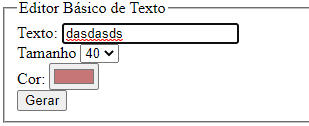

# aprendizagemPHP
_______________________________________________________________________

<h1> Editor de Texto Básico </h1>
Com a utilização de <b>PHP</b>,<b>HTML</b>,<b>CSS</b>

<h2>Interface Básica</h2>

  <h2>Pós submit</h2>

